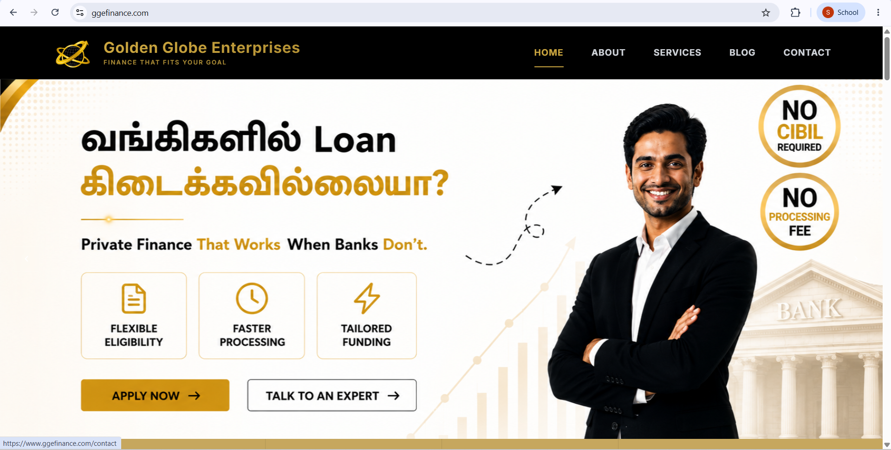
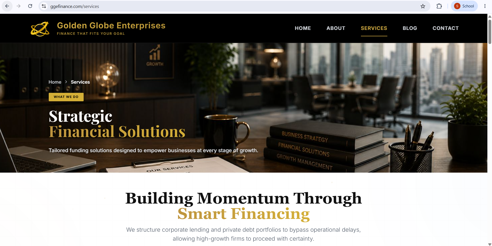
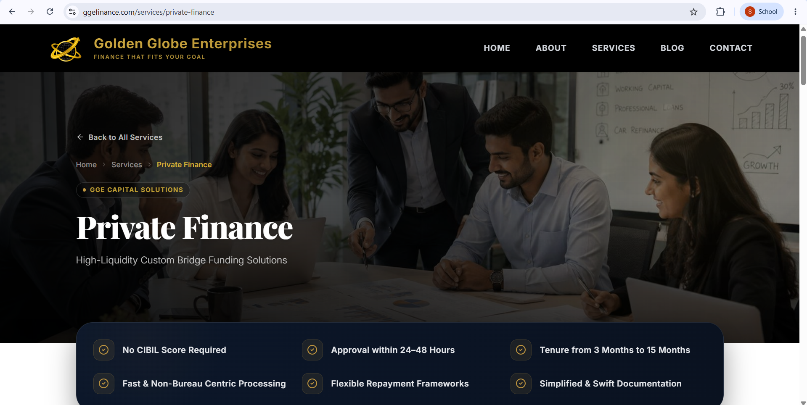
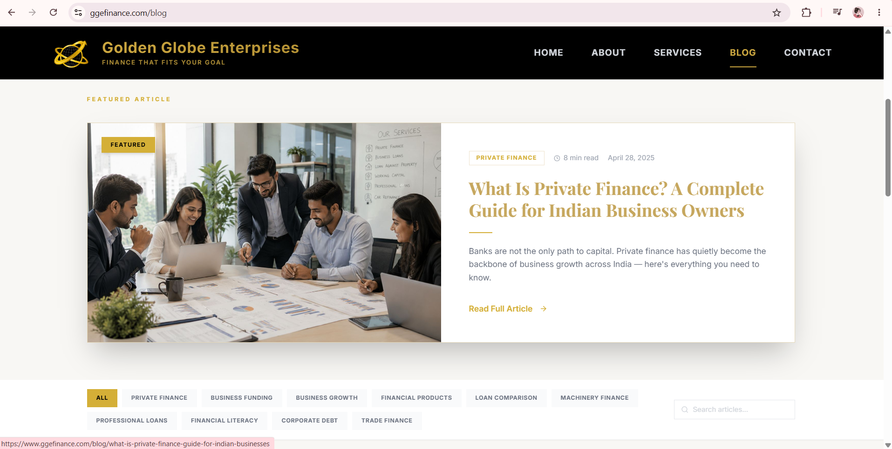
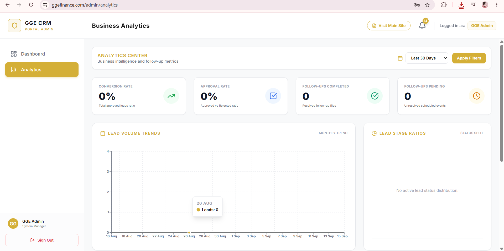
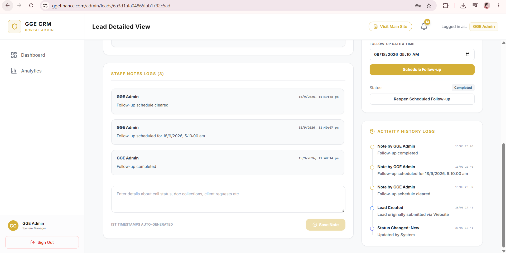

<div align="center">

<br />

# GGE Finance

### Golden Globe Enterprises — Financial Services Platform + Lead CRM

*A production full-stack platform built and deployed for Golden Globe Enterprises, Chennai.*

<br />

[](https://www.ggefinance.com)
[](https://www.ggefinance.com/admin/login)

<br />


<br />

</div>

---

## Overview

GGE Finance is a commissioned production project for Golden Globe Enterprises, a financial services firm in Chennai, Tamil Nadu — live, actively used, and serving real clients.

The platform operates as a complete business workflow:

**Customer submits enquiry → Lead saved to database → Admin receives real-time alert → CRM tracks follow-up → Analytics measures outcomes**

| Public Users | Internal Admin Team |
|---|---|
| Browse 11 financial services | Receive real-time lead notifications |
| Submit funding enquiries | Manage leads through a CRM pipeline |
| Use the EMI calculator | Schedule and track follow-ups |
| Read finance blog articles | Add notes and view activity history |
| Contact the team | Export lead data to CSV |

---

## Live Deployment

| Surface | URL | Access |
|---|---|---|
| Public Website | [ggefinance.com](https://www.ggefinance.com) | Open |
| Admin CRM | [ggefinance.com/admin/login](https://www.ggefinance.com/admin/login) | Restricted |
| Analytics Dashboard | [ggefinance.com/admin/dashboard](https://www.ggefinance.com/admin/dashboard) | Restricted |

---

## System Architecture

| Layer | Technology | Responsibility |
|---|---|---|
| Frontend | React 18, Tailwind CSS, Framer Motion | Public website — all pages and animations |
| Routing | React Router v6 | 15+ client-side routes |
| Form Submission | React state + Fetch API | Sends enquiry payload to REST API |
| REST API | Node.js + Express | Receives, validates, and processes enquiries |
| Database | MongoDB Atlas + Mongoose | Persists leads, notes, status history |
| Email Alerts | Nodemailer + Gmail SMTP | Sends formatted alert to admin on each submission |
| Real-time Push | Socket.IO | Broadcasts new lead instantly to active admin sessions |
| Authentication | JWT + bcrypt | Protects all admin CRM routes |
| Admin CRM | React (protected routes) | Lead management, follow-ups, analytics, CSV export |

---

## Project Structure

```
gge-finance/
|
|-- client/                             # React Frontend
|   |-- src/
|   |   |-- pages/
|   |   |   |-- Home.jsx               # Hero carousel, overview, testimonials
|   |   |   |-- Services.jsx           # 11 service cards, EMI calculator
|   |   |   |-- ServiceDetail.jsx      # Dynamic service detail pages
|   |   |   |-- PrivateFinance.jsx     # Featured product deep-dive
|   |   |   |-- About.jsx              # Company story, leadership, values
|   |   |   |-- Blog.jsx               # Article listing, filter, search
|   |   |   |-- BlogPost.jsx           # Dynamic slug-based blog post renderer
|   |   |   `-- Contact.jsx            # Enquiry form, Google Maps
|   |   |-- admin/
|   |   |   |-- AdminLogin.jsx         # Protected login screen
|   |   |   |-- Dashboard.jsx          # Analytics overview
|   |   |   |-- LeadList.jsx           # Lead management table
|   |   |   |-- LeadDetail.jsx         # Lead detail, notes, activity history
|   |   |   |-- FollowUps.jsx          # Follow-up scheduler
|   |   |   `-- Analytics.jsx          # Charts, conversion, source tracking
|   |   |-- data/
|   |   |   |-- servicesData.js        # All 11 service definitions
|   |   |   `-- blogData.js            # 8 authored blog articles
|   |   `-- components/
|   |       |-- Navbar.jsx
|   |       `-- Footer.jsx
|
`-- server/                             # Node.js + Express Backend
    |-- server.js                       # App entry point + Socket.IO setup
    |-- config/
    |   |-- db.js                       # MongoDB Atlas connection
    |   `-- mailer.js                   # Nodemailer SMTP config
    |-- models/
    |   `-- Enquiry.js                  # Mongoose lead schema
    |-- routes/
    |   |-- enquiry.js                  # POST /api/enquiry
    |   |-- leads.js                    # GET + PATCH /api/leads
    |   `-- auth.js                     # Admin authentication
    `-- controllers/
        |-- enquiryController.js        # Save lead, send email, emit socket event
        `-- leadController.js           # All CRM operations
```

---

## Features

### Public Website

| Page | Features |
|---|---|
| Home | Full-screen Swiper hero (EffectFade), per-slide Framer Motion stagger animations, animated CountUp stats strip, 3D tilt card effects, testimonial carousel, scroll-triggered reveals |
| Services | 11 financial products with individual detail pages, bento grid layout, Private Finance featured panel, working capital interactive tabs, EMI calculator with slider inputs and donut chart, 4-step funding journey tracker |
| Blog | 8 authored articles, sticky filter bar with category tabs and live search, featured article hero, dynamic slug-based routing, sidebar with CTA and stats, related articles per post |
| About | Mouse-parallax hero image, leadership profile (Prabhu, Founder), company journey timeline, animated trust counters, core values section |
| Contact | Validated enquiry form with success state, Google Maps embed, four contact info cards with direct call and email links |

### Admin CRM Panel

| Feature | Description |
|---|---|
| Authentication | JWT-protected login — no public access to any CRM route |
| Lead Pipeline | All submitted enquiries in a filterable table with status tags |
| Real-time Alerts | Socket.IO push — new lead appears in the dashboard instantly without page refresh |
| Email Notification | Nodemailer sends a formatted email to admin on every form submission |
| Notes and History | Internal notes per lead with full timestamped activity log |
| Follow-up Scheduler | Set and track follow-up dates with status reminders |
| Analytics Dashboard | Lead volume over time, source breakdown, conversion metrics |
| CSV Export | Download filtered lead data for offline reporting |
| Status Management | New / Contacted / In Progress / Closed / Lost |

---

## Tech Stack

### Frontend

| Technology | Purpose |
|---|---|
| React 18 | Component-based UI with hooks |
| React Router v6 | Client-side routing, 15+ routes |
| Tailwind CSS | Utility-first styling system |
| Framer Motion | Scroll animations, stagger reveals, page transitions |
| Swiper.js | Hero carousel and testimonials with EffectFade |
| Lucide React | Icon system |
| CountUp | Animated number counters |

### Backend

| Technology | Purpose |
|---|---|
| Node.js + Express | REST API server |
| MongoDB Atlas | Cloud-hosted document database |
| Mongoose | Schema modeling and validation |
| Socket.IO | Real-time lead push to admin sessions |
| Nodemailer | Email dispatch via Gmail SMTP |
| JWT | Admin session authentication |
| bcrypt | Password hashing |

---

## Financial Products

| # | Product | Key Detail |
|---|---|---|
| 1 | Private Finance | No CIBIL required · 24–48 hr disbursement · 3–15 month tenure |
| 2 | Business Loans | Banks and NBFCs · Flexible tenure · All business types |
| 3 | Professional Loans | Doctors · CAs · Architects · Consultants |
| 4 | Loan Against Property | Up to 70% LTV · Residential and commercial |
| 5 | Car Refinance | Up to 200% IDV · 48-hour approval |
| 6 | Working Capital | Overdraft · Cash Credit · CGTMSE · Trade Finance |
| 7 | Bank Guarantee | Performance · Financial · Tender BGs |
| 8 | Letter of Credit | Import · Export · Domestic · Sight and Usance |
| 9 | Packing Credit | Pre and post-shipment · RBI concessional rates |
| 10 | Machinery Purchase | New and second-hand · Asset-backed structuring |
| 11 | Medical Equipment | Clinic to hospital scale · MCI-registered professionals |

---

## API Reference

| Method | Endpoint | Description | Access |
|---|---|---|---|
| POST | `/api/enquiry` | Submit new customer enquiry | Public |
| GET | `/api/leads` | Fetch all leads | Admin |
| GET | `/api/leads/:id` | Get single lead detail | Admin |
| PATCH | `/api/leads/:id/status` | Update lead status | Admin |
| POST | `/api/leads/:id/notes` | Add internal note to a lead | Admin |
| GET | `/api/leads/export/csv` | Download leads as CSV | Admin |
| POST | `/api/auth/login` | Admin login, returns JWT | Public |
| GET | `/api/analytics/summary` | Dashboard metrics | Admin |

---

## Project Metrics

| Metric | Value |
|---|---|
| Pages | 15+ |
| React Components | 40+ |
| Financial Products | 11 |
| Blog Articles | 8 (original authored content) |
| API Endpoints | 8 |
| Framer Motion Animations | 50+ |
| Responsive Breakpoints | Mobile, Tablet, Desktop |
| Real-time Features | Socket.IO live lead push |
| Automated Emails | Triggered on every form submission |

---

## Engineering Decisions

| Decision | Reason |
|---|---|
| MongoDB over SQL | Lead data is document-shaped — notes arrays, status history, and variable metadata from different service enquiries suit a document store better than rigid relational tables |
| Socket.IO for alerts | Email has too much latency for a team expecting immediate follow-up; Socket.IO delivers sub-second push to any connected admin session the moment a lead is submitted |
| Framer Motion over CSS | Scroll-triggered reveals, staggered card entrances, and hero text animations that reset per carousel slide required JavaScript-level control that pure CSS could not provide cleanly |
| Swiper.js for hero | EffectFade combined with per-slide animation resets on `.swiper-slide-active` required a mature carousel library; Swiper's module system handled this without custom scroll logic |

---

## Security

| Measure | Implementation |
|---|---|
| Route protection | All CRM routes require a valid JWT on every request |
| Password storage | Hashed with bcrypt — plaintext is never persisted |
| Secrets management | All credentials via `.env` — never committed to the repository |
| Input validation | Enforced server-side before any database write |
| CORS policy | Restricted to production frontend origin in `NODE_ENV=production` |

---
---

## Product Screenshots

### Public Website

<table>
  <tr>
    <td width="50%">
      <h4>Homepage</h4>
      
    </td>
    <td width="50%">
      <h4>Financial Services</h4>
      
    </td>
  </tr>
  <tr>
    <td width="50%">
      <h4>Private Finance</h4>
      
    </td>
    <td width="50%">
      <h4>Blog</h4>
      
    </td>
  </tr>
</table>

### Admin CRM

<table>
  <tr>
    <td width="50%">
      <h4>CRM Dashboard</h4>
      
    </td>
    <td width="50%">
      <h4>Analytics Dashboard</h4>
      
    </td>
  </tr>
</table>
---

## Author

**Subha** — Full-Stack Web Engineer, CSE 2028, Rajalakshmi Engineering College, Chennai. Built as a commissioned freelance production project.

---

## License

Built for Golden Globe Enterprises as a commissioned freelance project. Codebase is proprietary — all business content, branding, and client data belong to Golden Globe Enterprises. Shared here for portfolio purposes only.

---

<div align="center">

Golden Globe Enterprises · Chennai, Tamil Nadu ·

</div>
